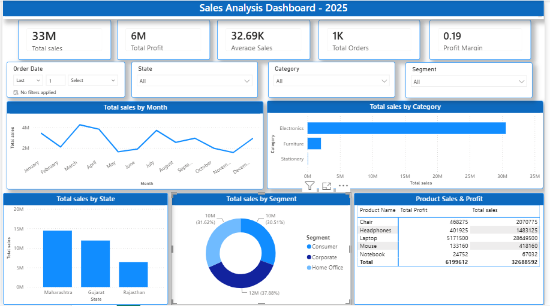

# 📊 Sales Analysis Dashboard 2025 | Power BI Project

## 🚀 Project Overview

The **Sales Analysis Dashboard** is an interactive Business Intelligence project developed using **Microsoft Power BI**.

The purpose of this project is to transform raw sales data into meaningful business insights by analyzing sales performance, profitability, customer segments, product trends, and regional performance.

This dashboard helps organizations understand their business performance and make data-driven decisions.

---

# 🎯 Project Objective

The main goal of this project is to:

- Analyze overall sales and profit performance
- Identify top-performing products and categories
- Understand customer segment behavior
- Compare sales across different regions
- Track monthly sales trends
- Build an interactive business dashboard

---

# 💼 Business Problem

Businesses often have large amounts of sales data but lack an easy way to understand:

- Which products generate maximum revenue?
- Which category performs better?
- Which locations contribute more sales?
- What customer segment brings more profit?
- How sales change over time?

This dashboard solves these problems by providing clear visual insights.

---

# 🛠️ Tech Stack

The project was developed using:

## 📊 Power BI Desktop
Used for:
- Dashboard creation
- Data visualization
- Interactive reports

## 🔄 Power Query
Used for:
- Data cleaning
- Removing errors
- Data transformation
- Preparing dataset

## 🧠 DAX (Data Analysis Expressions)

Used for creating:

- KPI calculations
- Profit measures
- Sales metrics
- Dynamic analysis

## 🗂️ Data Modeling

Created relationships between tables to improve analysis and reporting.

## 📁 File Format

- `.pbix` → Power BI Dashboard file
- `.xlsx` → Dataset
- `.png` → Dashboard Preview

---

# 📂 Dataset Information

The dataset contains sales information including:

- Order Date
- Product Name
- Category
- Customer Segment
- State
- Sales
- Profit
- Orders

The data was cleaned and transformed before creating the final dashboard.

---

# 📈 Dashboard Features

## 🔹 KPI Overview

The dashboard displays:

- 💰 Total Sales
- 📈 Total Profit
- 🛒 Total Orders
- 📊 Average Sales
- 📌 Profit Margin

---

## 📅 Monthly Sales Analysis

Analyzes sales trends month-wise to identify:

- Growth patterns
- High-performing months
- Low sales periods

---

## 🏷️ Category Analysis

Sales comparison between:

- Electronics
- Furniture
- Stationery

Helps identify the highest revenue-generating category.

---

## 🌎 Regional Sales Analysis

Analyzes sales performance by state:

- Maharashtra
- Gujarat
- Rajasthan

---

## 👥 Customer Segment Analysis

Customer contribution analysis:

- Consumer
- Corporate
- Home Office

---

## 📦 Product Performance

Detailed table showing:

- Product Name
- Total Sales
- Total Profit

Helps identify profitable products.

---

# 📊 Dashboard Preview

---

# 🔍 Key Insights

From this dashboard:

✔ Identified overall sales performance

✔ Compared category contribution

✔ Analyzed customer segment behavior

✔ Found high-performing regions

✔ Compared product profitability

✔ Observed monthly sales trends

---

# 🔮 Future Enhancements

Future improvements planned:

- Add real-time sales data connection
- Add sales forecasting using Machine Learning
- Create customer prediction analysis
- Add more advanced DAX calculations
- Deploy dashboard using Power BI Service
- Add automated reporting system

---

# 👩‍💻 Author

**Bhavi Savaliya**

B.Tech CSE Student  
Aspiring Data Analyst | Power BI Developer

🔗 GitHub: Your GitHub Profile Link

---

# ⭐ If You Like This Project

If you find this project useful or interesting:

⭐ Give this repository a star

📌 Share your feedback

🤝 Connect with me for collaboration and learning opportunities

---
# Thank you for visiting my project! 🚀
